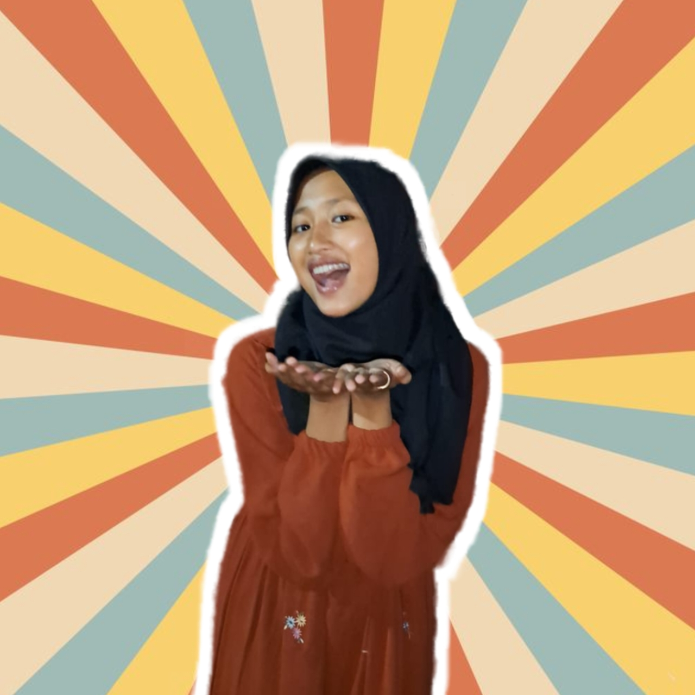
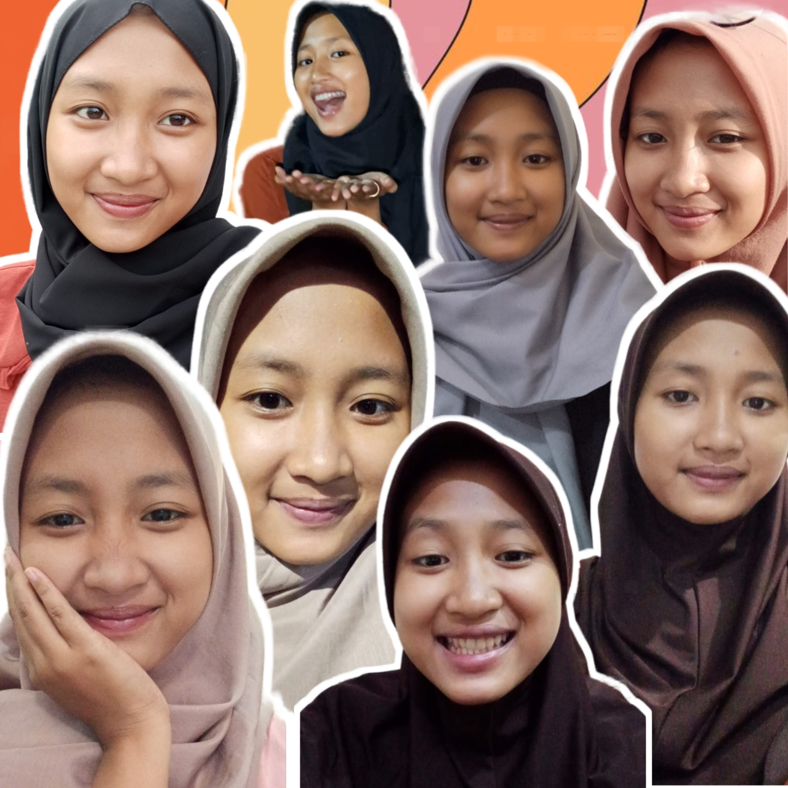
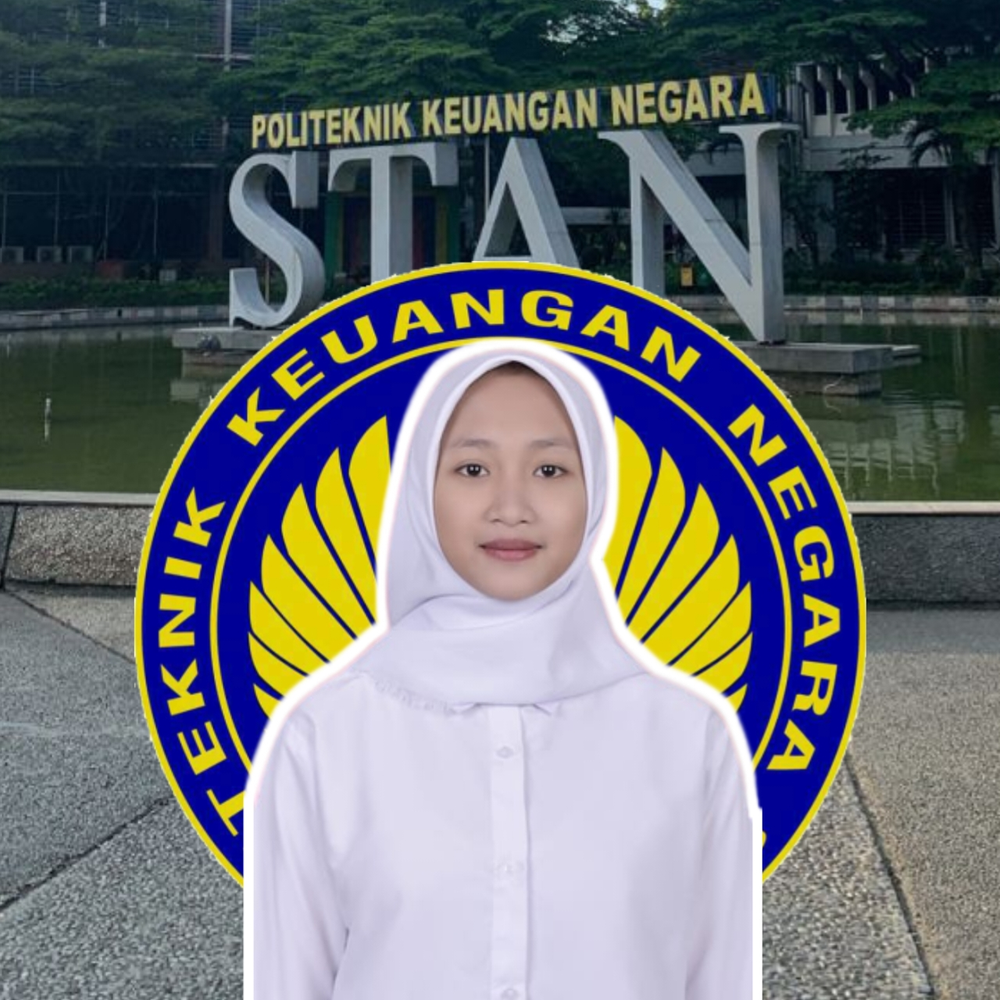

<html lang="en">
<head>
    <meta charset="UTF-8">
    <meta name="viewport" content="width=device-width, initial-scale=1.0">
    <link rel="stylesheet" href="styles.css">
</head>
<body>
    

      <h2>💗HAPPY BIRTHDAY SAYANG💗</h2>
      <h4>🎉 selamat ulang tahun ayy🎉
      Barakallah fii umrik. semoga panjang umur dan
      sehat selalu. ciee udah 18th udah tua banget
      semoga dengan bertambahnya usia ini, semoga kamu
      bisa menjadi pribadi yang lebih baik lagi,
      tambah semangat lagi ibadahnya,tambah rajin lagi
      belajarnya,tambah patuh kepada orang tua,tambah
      sayang ke adek dan tambah sayang ke akuu😙 
      wish you all the best ayy🤲 i love you🫶🫶</h4>
        
        <button onclick="nextLayer()">Klik ayy</button>
    

    

        <h2>💐happy 18th month mensiversary💐</h2>
        <h4>hai sayangg ga kerasa udah sejauh ini, terimakasih sudah mau menemani aku selama ini.  maaf aku masih banyak kurangnya belum bisa jadi seperti yg kamu inginkan, maaf saat bersamaku banyak rasa sakit daripada senengnya, semoga kedepannya kita bisa memperbaiki diri untuk kedepannya bisa lebih baik. terimakasih buat komitmennya selama ini  kamu selalu jaga hatimu buat aku. i love you sayang💐💗✨</h4>
        
        <button onclick="nextLayer()">Klik ayy</button>
    

    

        <h2>Selamat berjuang sayang semoga tahun ini masuk STAN!!!💪</h2>
        <h4>"Tidak ada proses yang mudah untuk tujuan yang
        indah, tetap fokus pada tujuan, karena masih dalam
        zona berjuang. Takdir milik Allah, tapi doa dan
        usaha milik kita. Semangat!"</h4>
        
   

    
    
</body>
</html>
